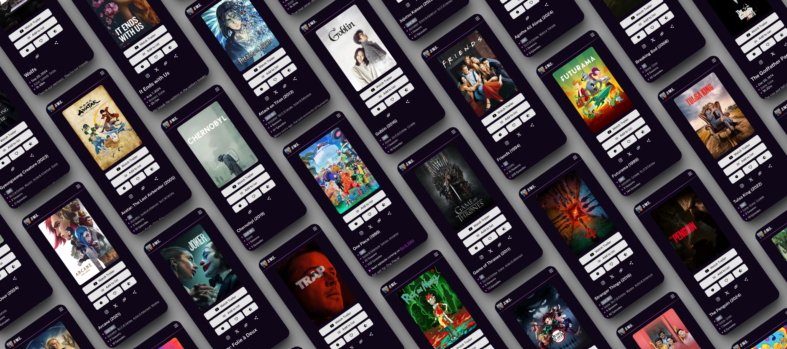
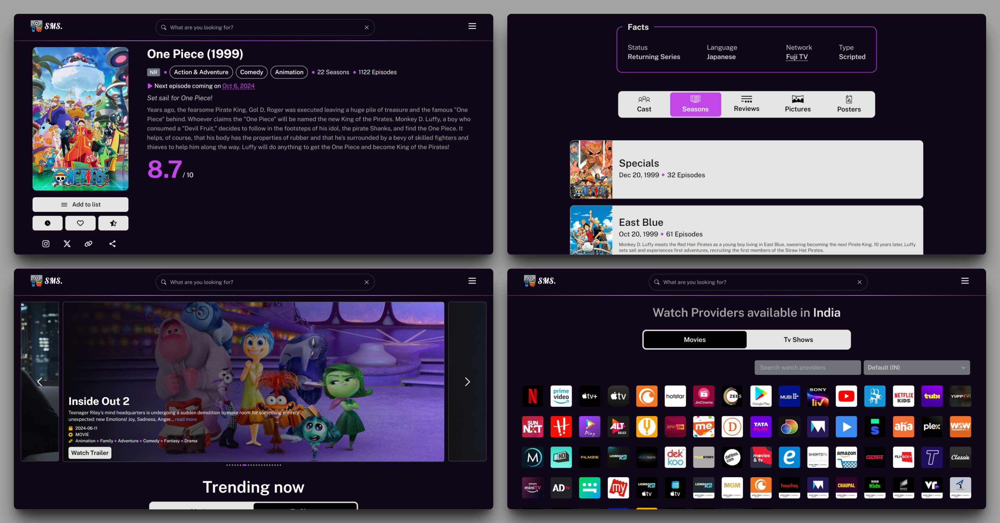

# 🎬 ShowMeShows

## 📑 Table of Contents

-   [🌟 Introduction](#-introduction)
-   [✨ Features](#-features)
-   [🖥️ Web Interface](#️-web-interface)
-   [📱 Android App](#-android-app)
-   [🔗 PWA Technology](#-pwa-technology)
-   [🛠️ Technologies Used](#️-technologies-used)

## 🌟 Introduction

Welcome to ShowMeShows, your ultimate companion for discovering and exploring the world of cinema! This project harnesses the power of React and the TMDB (The Movie Database) API to bring you a seamless movie & tv shows browsing experience across web and mobile platforms.

Whether you're a casual moviegoer or a die-hard film buff, our application provides you with a user-friendly interface to search, explore, and learn about your favorite movies and discover new ones.

## ✨ Features

-   🔍 **Powerful Search**: Find movies, tv shows, celebrities, collection and more.
-   🏆 **Top Rated & Popular**: Explore curated lists of critically acclaimed and fan-favorite films.
-   📅 **Upcoming Releases**: Stay updated with the latest and upcoming movie releases.
-   📊 **Detailed Movie Info**: Access comprehensive details including cast, crew, ratings, and reviews
-   📱 **Cross-Platform**: Enjoy a consistent experience on web browsers and Android devices.
-   🌙 **Dark Mode**: Easy on the eyes with our sleek dark mode.
-   🚀 **Blazing Smooth**: Optimized for smoothness to give you quick access to information.

## 🖥️ Web Interface

Our web interface offers a rich, interactive experience for exploration:

-   Responsive design that looks great on desktops, tablets, and mobile devices.
-   Infinite scrolling for effortless browsing through movie lists.
-   Dynamic search with autocomplete suggestions.
-   Detailed movie pages with trailers, photo galleries, and related recommendations.

## 📱 Android App

Experience the full power of TMDB Movie Explorer on your Android device:

-   Native Android feel with modern design components.
-   Offline mode for browsing previously viewed content (in development).
-   Smooth scrolling and animations to give better experience.

## 🔗 PWA Technology

Our Android app leverages Progressive Web App (PWA) technology, offering several benefits:

-   **Native App Experience**: Enjoy the look and feel of a native app with the flexibility of web technologies.
-   **Seamless Updates**: Get the latest features without manual app updates.
-   **Reduced App Size**: Smaller app footprint compared to traditional native apps.
-   **Offline Capabilities**: Access core functionality even without an internet connection (available soon).

## 🛠️ Technologies Used

-   **Frontend**: React, Tailwind, Lenis, Framer motion & Styled-Components.
-   **Other Pkgs**: Axios, React-hot-toast, React-icons & etc.
-   **API**: TMDB API with manual proxy server.
-   **Android**: Progressive Web App (PWA).

---

  Made with ❤️ by <a href="https://github.com/Chetan3010">Chetan Kale</a>

